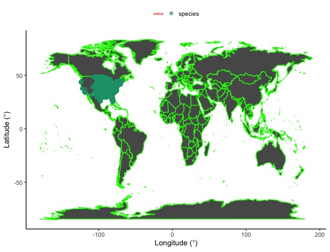
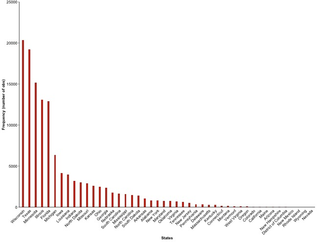
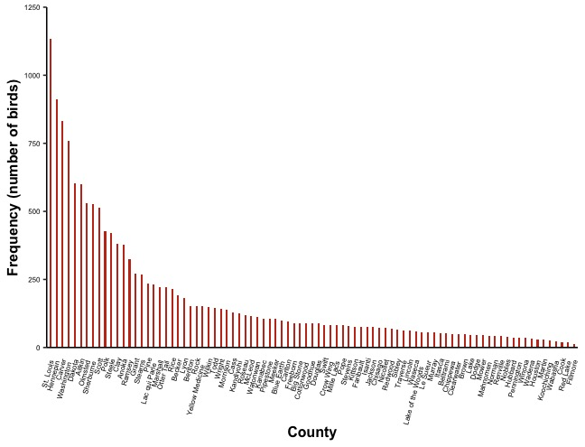
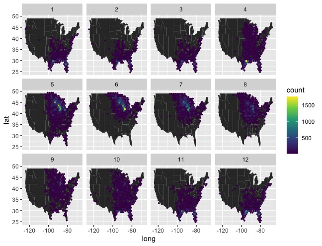
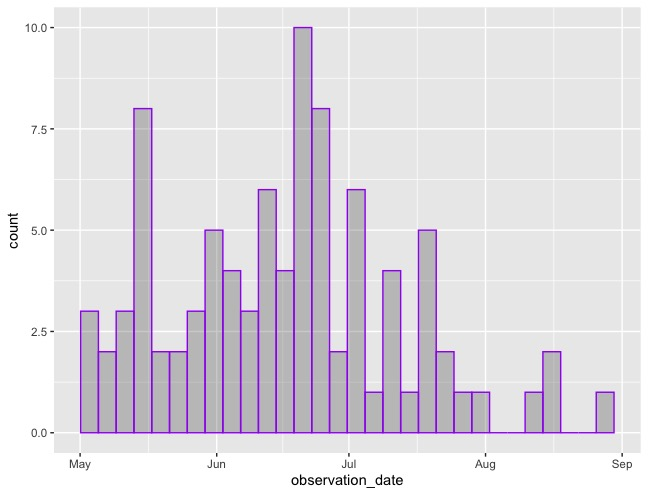
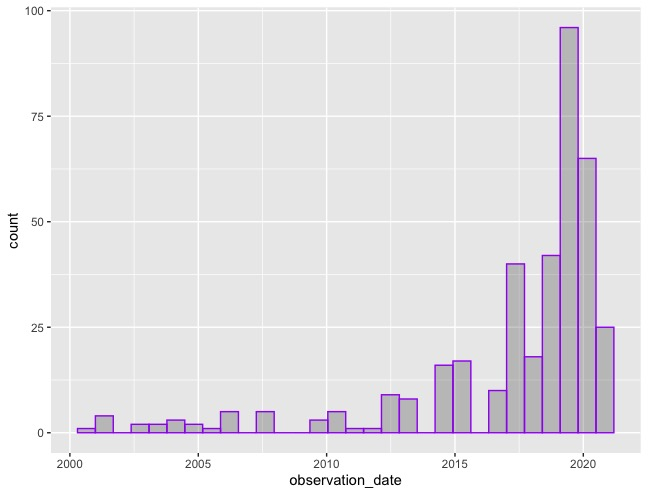
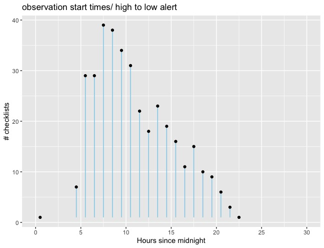

# AN EXPERIMENT DONE ON Sedge Wren

Hamze Omar, Dr. Merkord

Biosciences Department, Minnesota State University Moorhead, 1104 7th
Avenue South, Moorhead, MN 56563 USA

## Introduction

I am Researching about Sedge Wren. Sedge Wren is a bird found in North
America. Sedge Wren is also known as Cistothorus Stellaris. It is a
passerine bird in the family of Troglodytidae mostly found in wet
grasslands and meadows.These species are summer breeding. They
habitually build their nest as early as May and continues until late
August.

## Abstract

The Sedge Wren bird is a nomadic territorial bird. Meaning, these birds
can show up in a place or an area at once and completely be absent the
next. The population of Sedge Wren is divided into North American
countries, specifically, US, Canada, and Mexico, so it is not well
connected. Sedge Wrens forage on the ground for insects and spiders. In
this project, I will focus on the Sedge Wren family on the United States
soil. I will create a graphic map or visual map that shows the
characteristics of this bird, such as its breeding season from time to
time, how the observations are distributed in the States, which states
have the highest observations, etc. I will research the state of
Minnesota by counting observations in counties. Then, I will conduct
more research in Clay county, looking at the patterns of observations’
occurrence, then the time of the day the observation checklist starts.

The color spinach green specifies the species in the US soil.

## Methods

### Data Acquisition

First of all, I attempted to download the data, however, it was a large
dataset, which that case would take more space from my laptop, so I did
not have to request access from the original website of eBird. I went on
the MSUM class share website where the instructor uploaded it
(\\msumstudents.mnstate.edu) to minimize the size of the data.Then I
downloaded it. After the download, I read the data into RStudio (RStudio
Team, 2020). I also read into RStudio an auk package with bird
observations. I installed a cornel lab of ornithology with all the bird
observations of the dataset using the function
(remote::install\_girhub). I used (gridExtra) package from (Baptiste
Auguie 2017), (lubridate) package from (Garrett Grolemund 2011), (psych)
package from (Revelle, W. 2020), (readr, and dplyr) from (Hadley Wickham
2020) .

### Data Preparation

I used (gridExtra) package from (Baptiste Auguie 2017) for graphing and
drawing tables with plots, combine with (ggplot2) from (H. Wickham
2016). I used the (lubridate) package from (Garrett Grolemund 2011) to
work with dates basically to smooth the research during date and time. I
figured, I would need a (psych) package from (Revelle, W. 2020) for
psychological studies done by Sedge Wren Species. Finally, I used
“readr” and (dplyr) packages from (Hadley Wickham 2020) to help me
read the data and help me translate my thoughts into codes.

## Results

  - What are the top states that have the highest observations, and how
    are they categorized into lists?

Some States have greater observation than the other, the graph below
shows the relation.

  - Are the bird observations in the State of Minnesota distributed
    fairly into each county? Not at the same rate, some counties show
    higher observations, the gragh below shows the relation.

  - Do Sedge Wrens re-locate frequently due to natural obstacles, How do
    different seasons affect birds’ habitat?

  - In what months can observers experience the breeding season of Sedge
    Wren?

  - Have the observations increased since 2000?

  - At what time during the day or night does the observation time
    start?

## Discussion

  - What are the top states that have the highest observations, and how
    are they categorized into lists?

The graph shows the states that contain most observations to the least.

  - Are the bird observations in the State of Minnesota distributed
    fairly into each county?

The graph has similar patterns as question one, it is distributed in all
counties, but observations may vary. Some counties have higher
observations than the others.

  - Do Sedge Wrens re-locate frequently due to natural obstacles, How do
    different seasons affect birds’ habitat?

Sedge Wren migrates or re-locates for reasons. These include weather
conditions or avoiding predators.

  - In what month can observers experience the breeding season of Sedge
    Wren? The breeding season of Sedge Wren usually starts in Mid May
    until late August, also,the graph shows a high peak in late May, and
    an even higher peak in late June, this kind of breeding occurs when
    the birds migrate or re-locate within the season.

  - Have the observations increased since 2000?

Yes, observations have increased significantly since 2000

  - At what time during the day or night does the observation time
    start?

The observation checklist starts early in the morning and falls off
throughout the day at the highest peak time around 9 am-10 am

## Literature Cited

Hadley Wickham, Romain François, Lionel Henry and Kirill Müller (2021).
dplyr: A Grammar of Data Manipulation. R package version 1.0.5.
<https://CRAN.R-project.org/package=dplyr>

Garrett Grolemund, Hadley Wickham (2011). Dates and Times Made Easy with
lubridate. Journal of Statistical Software, 40(3), 1-25. URL
<https://www.jstatsoft.org/v40/i03/>.

Revelle, W. (2020) psych: Procedures for Personality and Psychological
Research, Northwestern University, Evanston, Illinois, USA,
<https://CRAN.R-project.org/package=psych> Version = 2.0.12,.

Hadley Wickham and Jim Hester (2020). readr: Read Rectangular Text Data.
R package version 1.4.0. <https://CRAN.R-project.org/package=readr>

Baptiste Auguie (2017). gridExtra: Miscellaneous Functions for “Grid”
Graphics. R package version 2.3.
<https://CRAN.R-project.org/package=gridExtra>

## Websites cited

eBird Basic Dataset. Version: ebd\_relFeb-2018. Cornell Lab of
Ornithology, Ithaca, New York. May 2013.

<https://www2.mnstate.edu/helpdesk/class-share-drive.aspx>
\\msumstudents.mnstate.edu
